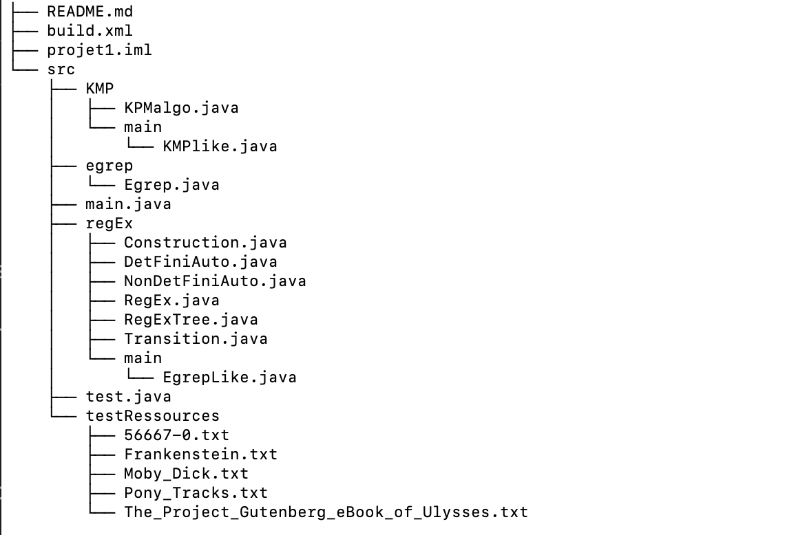

# Project Instructions
## Structure of the archive

## Introduction of the code source
All source files are located in the sourcecode/src directory, which contains three packages: KMP, egreplike, and egrep. Each package represents an implementation of different regular expression matching methods. Specifically, the main applications for the three algorithms are:

- Egrep.java: The main application for the Egrep algorithm.
- KMPlike.java: The main application for the KMP algorithm.
- EgrepLike.java: The main application for the EgrepLike algorithm.

During the testing process (test.java), we monitor the time complexity and space complexity of these programs by running and tracking their execution in separate threads.

## How to Run:

1. Use the following command to run the project:

   `java -jar <path_to_JAR/project1.jar> <regex_or_search_string> <filename_to_search>`

   Example:

   `java -jar /path/to/project1.jar (S(a|g|r)+on) Frankenstein.txt`

2. **Environment Requirements**: Ensure that you are using Java 17 or higher to avoid compatibility issues due to JDK versions.

3. **Automatic Algorithm Switching**: The project supports automatic algorithm switching. You simply need to replace `<regex_or_search_string>` in the command above with your desired search input (whether it’s a regular expression or a plain string). The program will automatically select the appropriate algorithm (either the regex algorithm or the KMP algorithm) based on the input.

4. **Pre-loaded Test Cases**: The project comes with five pre-loaded test files for your convenience:
   - 56667-0.txt
   - Frankenstein.txt
   - Moby_Dick.txt
   - Pony_Tracks.txt
   - The_Project_Gutenberg_eBook_of_Ulysses.txt

   Simply replace `<filename_to_search>` in the command with one of the above filenames to test the program.

5. **Ant Build Files**: There are two Apache Ant `build.xml` files included, one in the root directory of the compressed package and one in the root of the source code. Both files are identical and are provided for your reference and use.

6. **Test Cases Location**: The test cases are already included in the source code, located in `sourceCode/src/testRessources`.

7. **Performance Testing**: The performance test class is included in the source code at `sourceCode/src/test.java`. After running it, you can use the five test cases mentioned above for testing. The report contains results from 240 test cases, but to keep the project streamlined, only these five test cases are retained for your use.
